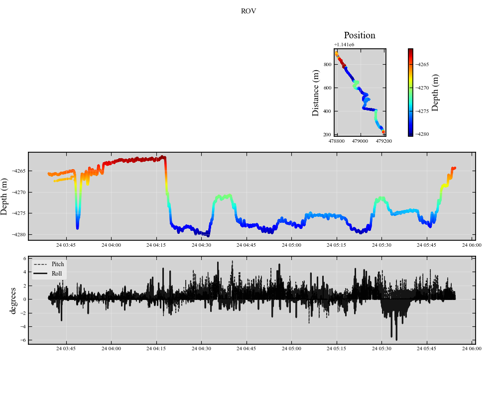

**Pose**
#################
Base class for working with position and orientation data

---------------

**Overview**
**********
----------

 - Standard format for position data used by DataSet classes
 - resampling and interpolation functionality for aligning with DataSet observation timesteps
 - basic plotting 
 
 
---------------

**Initializing**
************
-------------

The easiest way to initalize a Pose object is with a pandas dataframe containing a DateTime Index and the following columns
 - 'Easting' (x)
 - 'Northing' (y)
 - 'Depth' (z)
 - 'Pitch' 
 - 'Roll'
 - 'Heading' (yaw)

A name and projection also need to be supplied, along with an indication of the z_convention ('normal' = positive down) - Andy here. I sincerely apologize for this terrible unit and naming convention. I hope to ammend soon!

.. code-block:: python

    """Create a Pose object
    """
    # create a pose object for the station (timeseries of fixed position + orientation)
    df = pd.DataFrame({'Easting': 479753.7,
                       'Northing':1142907.6,
                       'Depth': 4330,
                       'Pitch': 0,
                       'Roll':0,
                       'Heading':0},
                        index = pd.to_datetime(adcp.get_ensemble_datetimes()))
    pose = pp.pose.Pose(df = df, name = 'Fixed Station', proj = 'EPSG:32611', z_convention = 'normal')
    
    
    
    # load timeseries trajectory of ROV data and plot
    df = pd.read_csv(r'.\example_data\mobile_adcp\position.csv', parse_dates = True, index_col = [0])
    df = df.iloc[25000:33000]
    
    
    pose = pp.pose.Pose(df = df, name = 'ROV', proj = 'EPSG:32611', z_convention = 'normal')
    pose.plot.trajectory() 
     

 
